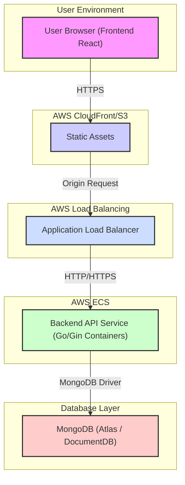

# InstaPoll Architecture Overview

This document provides a detailed overview of the technical architecture for InstaPoll, complementing the information in the main [README.md](../README.md). It outlines the system's components, their interactions, data flow, and deployment strategy, focusing on a cloud-native approach primarily leveraging AWS services.

## Guiding Principles

* **Scalability:** The architecture should handle varying loads, allowing for growth in users and polls.
* **Reliability:** The system should be resilient to failures in individual components.
* **Maintainability:** Components should be well-defined and loosely coupled for easier updates and debugging.
* **Cost-Effectiveness:** Leverage managed services where appropriate to reduce operational overhead.

## System Components

1.  **Frontend Application:**
    * **Technology:** Single Page Application (SPA) built with React/TypeScript (or similar).
    * **Responsibility:** Provides the user interface for creating, viewing, and voting on polls. Interacts with the backend via RESTful APIs.
    * **Hosting:** Static assets (HTML, CSS, JavaScript) are hosted on **AWS S3** and distributed globally via **AWS CloudFront** for low latency and high availability.

2.  **Backend API Service:**
    * **Technology:** Go application using the Gin web framework.
    * **Responsibility:** Handles core business logic, including:
        * Poll creation, retrieval, updates, and deletion (CRUD).
        * Vote processing and validation.
        * User authentication and authorization (planned).
        * Serving data to the frontend.
    * **Deployment:** Containerized using **Docker** and deployed as a service on **AWS Elastic Container Service (ECS)**, likely using Fargate for serverless container execution or EC2 instances for more control. An **Application Load Balancer (ALB)** distributes incoming traffic across container instances.

3.  **Database:**
    * **Technology:** **MongoDB**. Chosen for its flexible schema, suitable for evolving poll structures and potentially storing user data.
    * **Responsibility:** Persists application data, primarily poll definitions, options, vote counts, and user information (planned).
    * **Hosting:** Can be self-hosted on EC2/ECS or utilize a managed service like **MongoDB Atlas** or potentially **AWS DocumentDB** (with MongoDB compatibility).

4.  **Infrastructure & Operations:**
    * **DNS:** **AWS Route 53** manages the application's domain name and routes traffic to CloudFront and the Application Load Balancer.
    * **SSL/TLS:** **AWS Certificate Manager (ACM)** provides and manages SSL/TLS certificates for secure HTTPS connections.
    * **IaC:** **Terraform** is used to define and provision the AWS infrastructure resources in a repeatable and version-controlled manner.
    * **CI/CD:** **GitHub Actions** automates the build, test, and deployment pipeline for both frontend and backend components.
    * **Monitoring & Logging:** (Planned) Utilize services like **AWS CloudWatch** for logging, metrics, and alarms, potentially integrating with tools like Prometheus/Grafana if more advanced monitoring is needed.

## Data Flow (Example: Creating a Poll)

1.  User interacts with the **Frontend Application** in their browser to define a new poll.
2.  Frontend sends a POST request containing poll data to the **Backend API Service** endpoint (via ALB).
3.  The **Backend API Service** validates the incoming data.
4.  Upon successful validation, the service constructs a poll document and saves it to the **MongoDB** database.
5.  The service sends a success response back to the **Frontend Application**.
6.  The Frontend updates the UI to reflect the newly created poll.

## System Diagram (Conceptual)

## Scalability & Reliability

* **Frontend:** CloudFront and S3 provide high scalability and availability for static content.
* **Backend:** ECS allows for auto-scaling of backend containers based on load (CPU/Memory utilization). The ALB distributes traffic effectively. Multiple Availability Zone (AZ) deployment enhances reliability.
* **Database:** MongoDB (especially managed services like Atlas) offers built-in scalability (sharding) and high availability features (replica sets).

This architecture provides a solid foundation using managed AWS services and standard technologies, balancing scalability, reliability, and maintainability.
